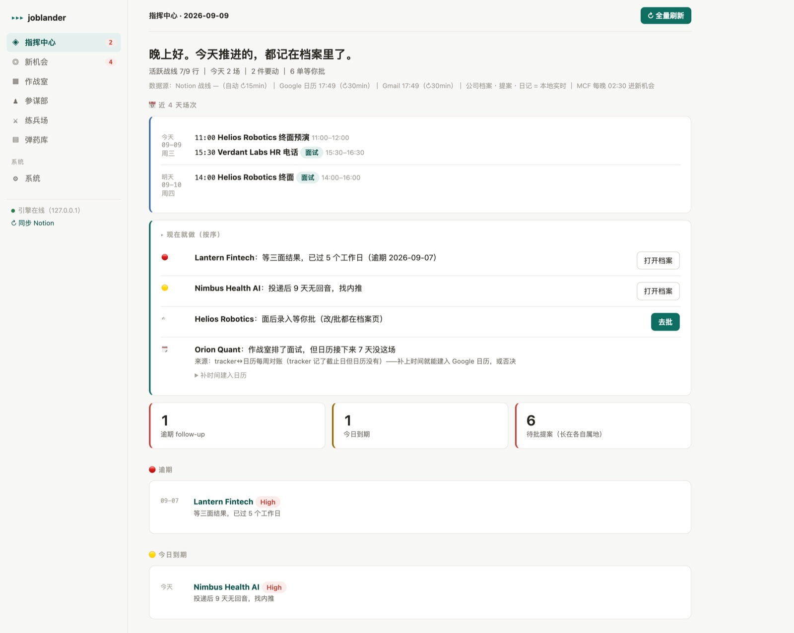
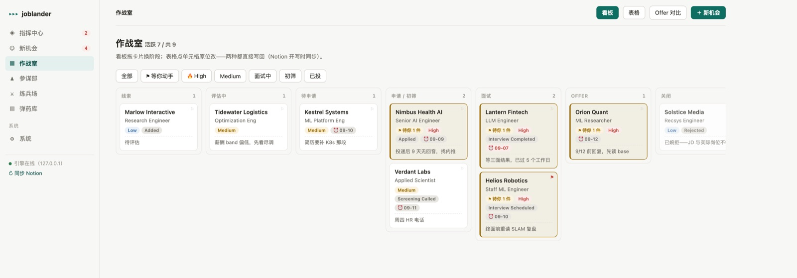
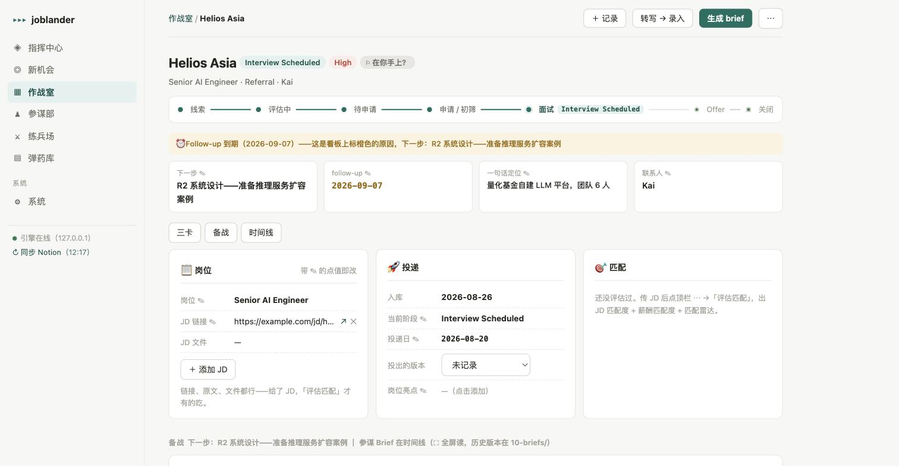
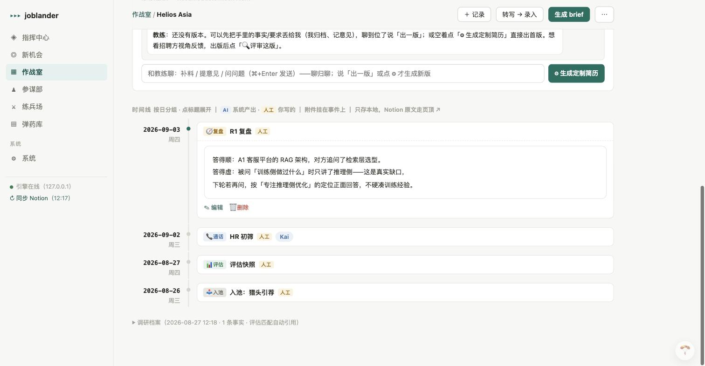

# JobLander

**English | [中文](README.zh-CN.md)**

> A multi-agent engine for running a job search — with guardrails, human approval gates, and an eval harness.

I was laid off in 2026. Job hunting turned out to be a distributed-systems problem wearing a trench coat: the JD is in one tab, the recruiter thread in email, the interview notes in a doc, the salary research in a spreadsheet, the tracker in Notion, the resume in a folder named `final_v3_ACTUAL`. Nine tools, no source of truth, and every context switch taxed the one resource I actually needed — the ability to walk into the next interview knowing exactly where I stood.

So I built the system I wanted, while fighting with it. It ran my entire search. Then I got an offer, and now it's open source.

**Status:** v0, battle-tested through a real job search. Web war room + all agents below are live, backed by 319 tests and blind-review eval scripts.



*The command center: what to do right now, what's overdue, what's waiting for your approval, and how fresh each data source is. (All screenshots use a fictional demo dataset.)*

> ⚠️ **The internals are in Chinese.** Prompts, the web UI, `docs/DESIGN.md`, and code comments are all Chinese — it was built as a personal tool first. The code, config, and this README are English-friendly, but you'll want to translate the prompts to use it in another language. PRs welcome.

---

## Why this might be interesting

Even if you never run it, a few design decisions here were expensive to learn and might save you the tuition:

**The human is part of the topology, not a checkbox.** Every outward action — sending a message, writing to the calendar, updating the source of truth — goes through a proposal queue. Agents never touch the outside world directly. This isn't safety theater: it's what made the system usable under stress, because I could let it run without auditing every token.

**Loop patterns should be chosen by evidence, not vibes.** The due-diligence agent runs multi-turn ReAct, because every search round brings in genuinely new external information. Resume customisation started as ReAct too — and never converged. Three-round A/B experiments showed the evaluator just kept finding *new* opinions each round (5→4→5 fixable issues), because the information set inside the loop is closed. It got demoted to self-refine, then to single-shot. **A loop without external information entering it isn't reasoning, it's paraphrasing** — and you pay for it in latency and tokens. Details in `evals/`.

**Layout-as-code beats prompting for format compliance.** The resume customiser used to output complete HTML and was told "don't change the styles." It changed the styles. Now it outputs structured content JSON, and layout plus identity (name, contact) are rendered by fixed code. Style drift and identity fabrication became *impossible by construction* rather than *discouraged by instruction*.

**Judges must never be weaker than the thing they judge.** Evaluation runs on a dedicated model tier, with blind reviews whose information set is deliberately restricted (the recruiter reviewer sees only resume + JD, like a real screener), plus randomized mapping and zero-LLM hard checks — three defenses against a model rating its own family's output generously.

**Policy as code, not prose.** Walk-away numbers, equity discount tiers, and FX conversions are pure-function parameters in a private config. Negotiation judgments become explainable and regression-testable — and the actual numbers never enter the repo.

**Spend nothing where judgment isn't needed.** Scheduling constraint checks, format validation, red-line assembly, and resume rendering are all zero-LLM. The LLM is for judgment; everything else is code.

---

## Quickstart

Requires Python 3.10+ and an LLM API key (OpenAI or Gemini). Verified on 3.11 and 3.14, editable and regular installs.

```bash
git clone https://github.com/Shuailong/joblander.git
cd joblander
python -m venv .venv && source .venv/bin/activate
pip install -e ".[dev]"

cp config.example.yaml config.yaml
$EDITOR config.yaml            # set workspace_dir, llm, sentinel rules, policy numbers
export OPENAI_API_KEY=sk-...   # or GEMINI_API_KEY

joblander onboard              # health-checks config, scaffolds the workspace
joblander web                  # war room at http://127.0.0.1:8899
```

`onboard` tells you exactly what's missing and scaffolds the workspace directory tree. Nothing else needs configuring to start — Notion, Gmail, and search integrations are optional and stay dormant until you fill them in.

**Your data never enters this repo.** The engine is code-only; resumes, compensation numbers, pipeline state, and red-line phrasing all live in a private `workspace_dir` that `config.yaml` (gitignored) points at. See DESIGN §13.

### Configuration map

| Section | Required | What it does |
|---|---|---|
| `workspace_dir` | ✅ | Where all your private data lives |
| `llm` | ✅ | Provider + three model tiers (`model` / `model_flash` / `model_eval`); API key via env var |
| `sentinel.rules` | strongly recommended | Your red lines — the guard is inert without them |
| `policy` | needed for Analyst | `quote_tc_sgd` + `fx` are hard dependencies; discount tiers and reference conversions optional |
| `search` | needed for due diligence | Tavily (free tier is plenty), Brave, or Google CSE |
| `notion` | optional | Use Notion as tracker + mobile entry point; without it, everything stays local |
| `gmail` | optional | Auto-sourcing from email (read-only scope) |

### CLI

```bash
joblander web                     # the war room (this is the main interface)
joblander onboard                 # config health check + workspace scaffold
joblander research <company>      # zero-input due diligence
joblander brief <company>         # pre-interview brief
joblander check "<text>"          # run text past the Sentinel guard
joblander intake <file>           # add an opportunity from pasted text
joblander weekly                  # weekly report
joblander daemon                  # background jobs (calendar sync, reminders, scans)
```

---

## What it looks like



The **war room** — every opportunity on one board, dragged between stages, edited in place. Amber marks system-computed to-dos (unapproved proposals, due follow-ups); red marks the ones you flagged yourself as "ball's in my court."



Each company gets a **dossier page**: stage flow, the one thing to do next, JD lifecycle, match assessment, and the full battle history.



The **timeline** is the company-level source of truth, and every entry is stamped `AI` or `人工` (human). You can always tell what the system claimed versus what you observed — which matters a lot when you're about to repeat something in an interview.

---

## Architecture

```
Perception          Agents                      Gate           Memory
──────────          ──────                      ────           ──────
Gmail scan   ┐                                                 Event Log (JSONL, SoT)
Notion diff  ├──►  Intelligence  ─┐                            Company archives
MCF postings │     Resume        ─┼──► proposals ──► YOU ──►   Achievement bank
Paste/upload ┘     Operations    ─┘         ▲                  Playbook
                                            │                  Golden sets
                   Sentinel (cross-cutting) ┘
```

The **Event Log is the source of truth** (ADR-1); everything else is a projection that can be rebuilt from it. Notion, when enabled, is the most important *human* projection and edit surface — not the source of truth. Agents are stateless: context pack in, artifact or proposal out. Features are composed as workflows rather than one agent per feature (ADR-9).

Full architecture, 16 ADRs with rejected alternatives and accepted costs, state machines, and the Notion reconciliation design: **[`docs/DESIGN.md`](docs/DESIGN.md)** (Chinese).

### Agent teams

#### 🕵️ Intelligence — see the other side before the fight

| Agent | Role | Architecture |
|---|---|---|
| **Diligence** | Zero-input company research: highlight card + four-section profile (every claim carries a numbered source) + per-round trail | **Multi-turn ReAct**: plans searches, then loops "read body excerpts → judge five-way coverage (hiring motive / interview process / tech stack / compensation / stability) → issue new queries for the gaps". Filters repeated queries, marks dead corners after consecutive misses, stops when no new pages appear. Quality gate: zero-LLM hard checks + five-dimension blind review |
| **Analyst** | JD + achievement bank + dossier + salary signals → two-score match snapshot + a radar whose axes are derived from that specific JD | LLM judgment + **policy-as-code**: walk-away lines and discount tiers are pure-function parameters |
| **Compensation** | A dated market-band report the moment a company enters the pool — numbers before conversations | Researcher evidence side + Analyst statistics side |

#### 📝 Resume — single-shot generation, two-tier review, one coach

| Agent | Role | Architecture |
|---|---|---|
| **Customiser** | Achievement bank + JD + accumulated feedback → tailored resume | **Single-shot, layout-as-code**. The automatic revision loop was removed after it failed to converge; improvement comes from persistently accumulated feedback, with every version regenerated whole |
| **Evaluator duo** | Separates "agent can fix it" from "needs material only you have" | ① **Recruiter blind review** — information set restricted to resume + JD; ② **Coach triage** — checks against the achievement bank, discipline: "search the bank before asking the user". Manually triggered, so it never taxes generation |
| **Coach** | Conversational intake: catches, classifies, archives whatever you throw in | Three-way classification (fact / opinion / reply); facts archived to specific bank entries, append-only, proposal-confirmed |

#### ⚙️ Operations — turn chores into drafts and proposals

| Agent | Role | Architecture |
|---|---|---|
| **Scout / Sourcing** | Email, pastes, job-board signals → standardized opportunity proposals | flash-tier extraction; discipline: null when unknown, never guess |
| **Scribe** | Interview transcripts / PDFs → fields + body + status proposals | Nothing written back until approved |
| **Prep** | Pre-interview brief built around situation assessment + what to do next, readable in 10 minutes | Prioritizes recent retros and the other side's feedback as evidence; **user gold standards frozen into an eval** (length budget, no list-dumping, Q&A quota, hallucinated-citation detection) with quotas hard-enforced in code; degrades to a template skeleton if the LLM is down |
| **Coordinator** | Pasted invitation → candidate slots → recommendation + reply draft (you send it) | Slot extraction uses an LLM; scheduling judgment is **pure rules** against your calendar |
| **Referral matcher** | Contact map → referrer suggestions + outreach draft (you send it) | Text retrieval + flash-tier selection |

#### 🛡️ Sentinel — cross-cutting guard, no bypass

Every outbound artifact is inspected. A **rule layer** catches phrasing red lines, numeric drift, and format violations; a **judgment layer** (LLM) handles what rules can't — narrative timing, cross-material consistency, semantic drift. The engine implements only rule *types* (`pattern` / `precision` / `pair`); the actual words and numbers live in your private config, so the public repo contains none of your red lines.

---

## Evals

Prompt systems without a regression set make every change a gamble (ADR-5), so evals were built alongside the system rather than after it:

```bash
python -m evals.resume_eval <company>     # recruiter blind review + coach triage
python -m evals.summary_eval <company>    # due-diligence summary: hard checks + 5-dim review
python -m evals.brief_eval <company>      # pre-interview brief against user gold standards
python -m evals.user_agent                # LLM plays the user and walks the running web UI
pytest                                    # 319 tests
```

Each eval pairs **zero-LLM hard checks** (deterministic, catch format and discipline violations for free) with **LLM blind review** (judgment). The golden sets themselves are private — they're built from real job-search data.

---

## What this is not

- **Not a job-application bot.** It never applies on your behalf, never sends a message, never posts anything. Every outward action is a draft that you send. That's a deliberate design constraint (ADR-10), not a missing feature.
- **Not multi-tenant.** Single user, local-first, your own API keys. There's no hosted version and no account system.
- **Not a framework.** Orchestration is hand-written on purpose (ADR-6) — at this scale the framework would have black-boxed the most instructive part.
- **Not tuned for you yet.** The policy numbers are Singapore/SGD-shaped, the prompts are Chinese, and the Sentinel rules are empty until you write your own. Set `JOBLANDER_TZ` to your own timezone — it defaults to UTC+8.

---

## Support

JobLander is free and stays free — Apache-2.0, no hosted tier, nothing to upsell. If it helped you land something, the best thanks is passing it on to the next person who's searching.

If you'd rather buy the coffee: [**☕ Buy me a coffee**](https://buymeacoffee.com/lucasliang)

---

## License

[Apache-2.0](LICENSE) — see also [ailayoff.me](https://ailayoff.me) for the project site.
