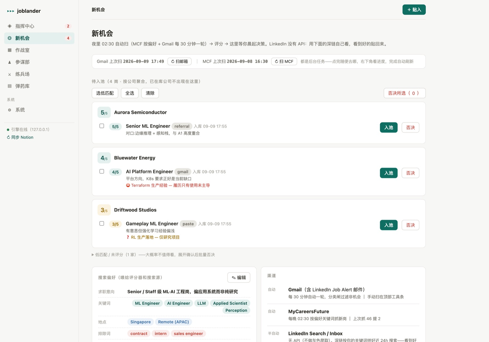
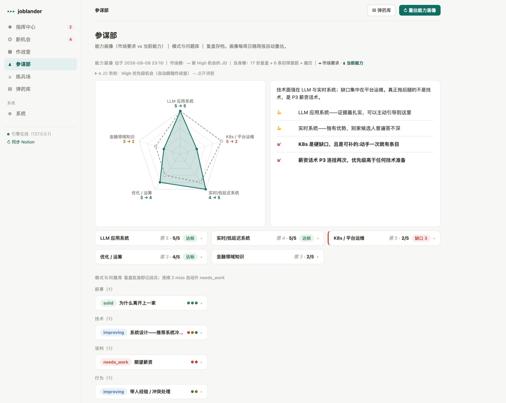
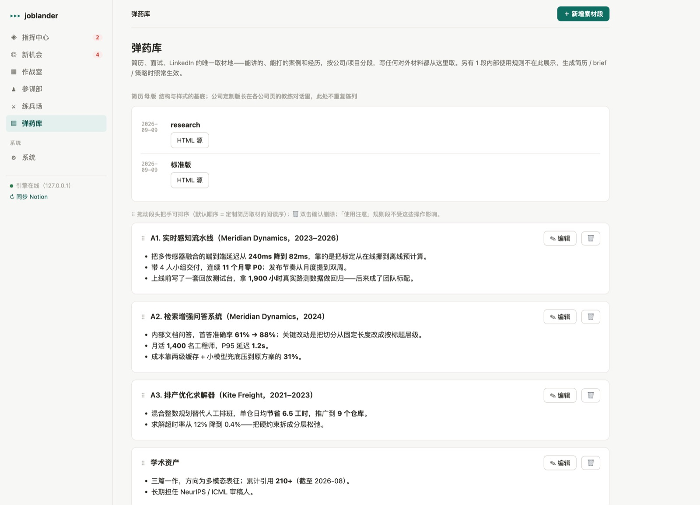
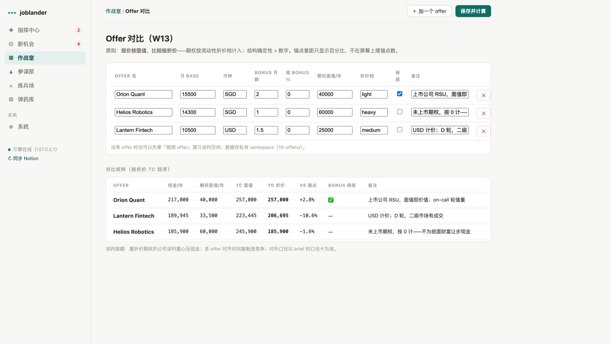
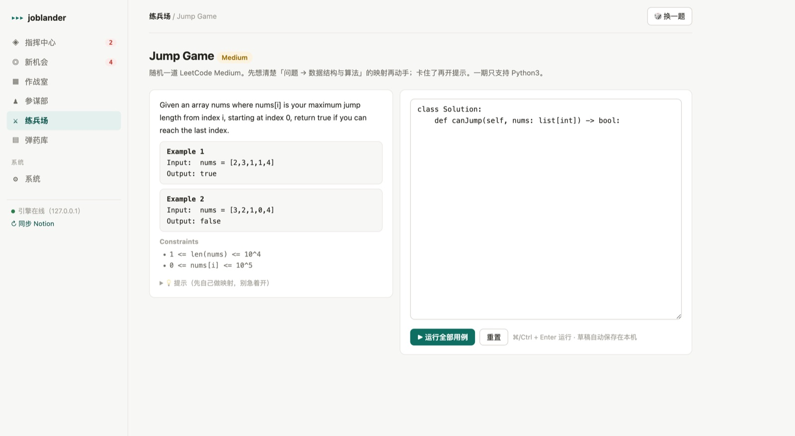

# JobLander

**[English](README.md) | 中文**

> 求职作战引擎：多 Agent、有守卫、有审批闸门、有评测。

2026 年我被裁了。求职这件事很快暴露出它的真面目——一个披着风衣的分布式系统问题：JD 在一个标签页，猎头对话在邮箱，面试记录在文档，薪资调研在表格，战线在 Notion，简历在一个叫 `final_v3_ACTUAL` 的文件夹里。九个工具，没有事实源，每一次上下文切换都在消耗我真正需要的那个资源——走进下一场面试时，清楚知道自己站在哪里。

所以我一边打仗一边造了这个系统。它跑完了我整场求职。然后 offer 来了，现在它开源了。

**状态：** v0，真实战场跑完。web 作战室 + 下述全部 Agent 落地，326 个测试 + 盲评脚本背书。


*指挥中心：现在就做什么、什么逾期了、什么在等你批、每个数据源新鲜到几点。（全部截图使用虚构演示数据。）*

---

## 为什么这个项目可能值得一看

哪怕你永远不跑它，这里有几个决策的学费是我已经付过的：

**人在环内是拓扑的一部分，不是一个复选框。** 一切对外动作——发消息、写日历、写事实源——都走提案队列，Agent 从不直接碰外部世界。这不是安全表演：正因如此我才敢在高压期放手让它跑，不必逐 token 审计。

**循环模式该按证据选，不是凭感觉。** 尽调员跑多轮 ReAct，因为每轮搜索都真的带回外部新信息。简历定制一开始也是 ReAct——从来没收敛过。三轮 A/B 实验显示裁判每轮都在找**新**意见（可修问题 5→4→5），因为环内的信息集是封闭的。它先降级成 self-refine，再降成单轮。**一个没有外部信息进入的循环不是推理，是换个说法重述**——代价是成倍的延迟和 token。细节见 `evals/`。

**版式代码化胜过用 prompt 求格式合规。** 简历定制官过去输出完整 HTML，并被告知「不要改样式」。它改了。现在它只输出结构化内容 JSON，版式与身份（姓名、联系方式）由固定代码渲染。样式漂移和身份编造从「被指令劝阻」变成了**构造上不可能**。

**裁判永远不能弱于被裁判的东西。** 评测走独立模型档位，盲评的信息集被刻意限制（招聘方视角只看简历 + JD，就像真的初筛），加上随机映射和零 LLM 硬检查——三重防线，防的是模型给自己同族的产物打高分。

**策略即代码，不是散文。** 走人线、股权折价档、汇率换算都是私有 config 里的纯函数参数。谈判判断因此可解释、可回归——而真实数字永远不进仓库。

**能省则省。** 排期约束检查、格式校验、口径卡拼装、简历渲染全部零 LLM。LLM 用来做判断，其余都是代码的事。

---

## 快速开始

需要 Python 3.10+ 和一个 LLM API key（OpenAI 或 Gemini）。3.11 与 3.14、editable 与普通安装均已实测。

```bash
git clone https://github.com/Shuailong/joblander.git
cd joblander
python -m venv .venv && source .venv/bin/activate
pip install -e ".[dev]"

cp config.example.yaml config.yaml
$EDITOR config.yaml            # 填 workspace_dir、llm、sentinel 规则、policy 数字
export OPENAI_API_KEY=sk-...   # 或 GEMINI_API_KEY

joblander onboard              # 配置体检 + workspace 脚手架
joblander web                  # 作战室 http://127.0.0.1:8899
```

`onboard` 会告诉你缺什么，并把 workspace 目录树建好。开始用不需要配别的——Notion、Gmail、搜索都是可选集成，不填就静默休眠。

**你的数据永远不进这个仓库。** 引擎只有代码；简历、薪资数字、pipeline 状态、口径红线全部住在私有 `workspace_dir` 里，由 `config.yaml`（已 gitignore）指过去。见 DESIGN §13。

### 配置速查

| 段 | 必需 | 作用 |
|---|---|---|
| `workspace_dir` | ✅ | 所有私有数据的所在地 |
| `llm` | ✅ | provider + 三档模型（`model` / `model_flash` / `model_eval`）；API key 走环境变量 |
| `sentinel.rules` | 强烈建议 | 你的红线——不填守卫就是空转 |
| `policy` | Analyst 需要 | `quote_tc_sgd` + `fx` 是硬依赖；折价档与参考换算线可选 |
| `search` | 尽调需要 | Tavily（免费档够用）、Brave 或 Google CSE |
| `notion` | 可选 | 拿 Notion 当战线看板 + 移动端入口；不配则全本地 |
| `gmail` | 可选 | 邮件自动 sourcing（只读 scope） |

### CLI

```bash
joblander web                     # 作战室（主界面）
joblander onboard                 # 配置体检 + 脚手架
joblander research <公司>         # 零输入尽调
joblander brief <公司>            # 面前 brief
joblander check "<文本>"          # 过一遍 Sentinel 守卫
joblander intake <文件>           # 贴入内容录一条线索
joblander weekly                  # 周报
joblander daemon                  # 后台作业（日历同步、提醒、扫描）
```

---

## 长什么样

*以下截图全部使用虚构演示数据——公司、人名、数字都是编的。*



**新机会。** 夜里的自动扫描（招聘站 + 邮箱）落到这里，对照弹药库打 1–5 分、按公司聚合，并逐条点明缺口——「Terraform 生产经验 — 履历只有使用未主导」。你不批，什么都进不了战线。


**作战室**——所有战线一块板，拖卡换阶段，点格原位改。琥珀色是系统算出来的待办（未批提案、到期 follow-up），红色是你自己标的「球在我这」。


每家公司一个**档案页**：阶段流转、下一步唯一动作、JD 生命周期，以及一张**按这份 JD 提炼轴**的匹配雷达——不是套通用模板。琥珀色那块是待批提案，写进任何地方之前你都可以先改字段。


**时间线**是公司级事实源，每条都标 `AI` 或 `人工` 署名。系统声称的和你亲眼见的永远分得清——这一点在你即将把某句话复述进面试时特别重要。



**参谋部。** 能力画像把「市场要什么」和「你的复盘真能证明什么」画在一张雷达上，每周按你正在追的 JD 重估——某个维度没有复盘证据就该打低分，缺口随即变成一条具体任务。下面是模式与问题库：每道被问过的题、当前最佳答法、最近三战是 hit 还是 miss。连续 2 次 miss 自动升级为 `needs_work`。



**弹药库**是所有进入简历、面试、brief 的数字的唯一取材地，只追加、按段编辑。最后一段是规则段——内部代号怎么转译、哪些数字不许四舍五入放大——它照常参与生成，但不在这个列表里展示。



**Offer 对比**——报价按面值，比较按折价。这里面值总包**最高**的那个，在未上市期权按 0 折价之后掉到了最后一名。这正是重点：折价档是你私有 config 里的参数，所以排序可解释、可回归测试。



**练兵场**——随机一道题，本地跑用例，全程零 LLM。手不能生也是求职的一部分，所以它跟别的东西放在同一个地方。

---

## 架构

```
感知层              Agent 队                     闸门         记忆层
──────              ────────                     ────         ──────
Gmail 扫描  ┐                                                 Event Log（JSONL，SoT）
Notion 差量 ├──►  情报队  ─┐                                  公司档案
MCF 挂牌    │     简历队  ─┼──► 提案 ──► 你 ──►               弹药库
贴入/上传   ┘     流程队  ─┘        ▲                         Playbook
                                     │                        金标集
                  Sentinel（横切）───┘
```

**Event Log 是事实源**（ADR-1）；其余一切都是可以从它重建的投影。启用 Notion 时，它是最重要的**人用**投影与编辑入口——不是事实源。Agent 无状态：输入上下文包，输出制品或提案；功能靠 workflow 组合，不按功能拆 agent（ADR-9）。

完整架构、16 条 ADR（含备选方案与已接受代价）、状态机、Notion 双向和解设计：**[`docs/DESIGN.md`](docs/DESIGN.md)**。

### Agent Teams

#### 🕵️ 情报队 —— 打之前先看清对面

| Agent | 职责 | 架构 |
|---|---|---|
| **尽调员 Diligence** | 零输入公司尽调：要点卡 + 四段简介（断言带编号来源）+ 逐轮轨迹 | **ReAct 多轮**：计划检索后循环「读正文摘录 → 判五项覆盖（动因/面试/技术栈/薪酬/稳定性）→ 为缺口出新查询」；重复查询滤停、连续落空标死角、抓不到新页止损。质量门：零 LLM 硬检查 + 五维盲评 |
| **评估匹配 Analyst** | JD + 弹药库 + 尽调档案 + 薪酬信号 → 双分匹配快照 + 按该 JD 提炼轴的雷达 | LLM 判断 + **策略即代码**：底线、折价档等全是纯函数参数 |
| **薪酬调研** | 入池即出带日期的市场 band 报告——先有数字再进对话 | Researcher 证据端 + Analyst 统计端合作 |

#### 📝 简历队 —— 单轮直出、两级评审、一个教练

| Agent | 职责 | 架构 |
|---|---|---|
| **Customiser** | 弹药库 + JD + 累积意见 → 公司定制版 | **单轮生成，版式代码化**。自动改稿环因实测不收敛已拆除；改进靠意见持久累积，每版整份重新生成 |
| **Evaluator 二人组** | 把「能修的」和「缺料的」分开 | ①**招聘方盲评**——信息集只给简历 + JD；②**教练分拣**——对照弹药库分类，纪律「先查库再开口」。按需手动触发，不占生成时间 |
| **简历教练（弹药官）** | 对话式收料：接住、归类、归档 | 三分类（事实/意见/回话）；事实定点归档到具体条目，只追加不删改，提案确认制 |

#### ⚙️ 流程队 —— 把杂活变成草稿和提案

| Agent | 职责 | 架构 |
|---|---|---|
| **Scout / Sourcing 侦察** | 邮件、贴入、多源信号 → 标准化机会提案入池 | flash 档抽取；纪律：查不到就 null，不猜 |
| **Scribe 书记** | 面试转写 / PDF → 字段 + 正文 + 战况提案 | 批准前不写回 |
| **Prep 参谋** | 面前 brief：局面判断 + 接下来的打法，10 分钟读完 | 判断依据优先最近复盘与对方反馈；**用户金标固化为 eval**（长度预算/不罗列/问答限量/幻觉编号），配额代码侧硬截断；LLM 掉线降级模板骨架 |
| **Coordinator 排期** | 贴入邀约 → 候选时段 → 推荐 + 回复草稿（你发） | 时段抽取用 LLM，排期判断**纯规则**对照日历 |
| **内推匹配** | 人脉地图 → 内推人推荐 + 触达草稿（你发） | 文本检索 + flash 档选人 |

#### 🛡️ Sentinel —— 横切守卫，不设旁路

所有出口产物统一过检。**规则层**拦口径红线、数字漂移与格式；**判断层**（LLM）管规则拦不住的——叙事时机、跨材料一致性、语义漂移。引擎只实现规则**类型**（`pattern` / `precision` / `pair`），真实词表与数字全在你的私有 config 里，公开仓库不含任何红线内容。

---

## 评测

没有回归集的 prompt 系统，每次改动都是赌博（ADR-5），所以评测是跟系统同生的，不是事后补的：

```bash
python -m evals.resume_eval <公司>     # 招聘方盲评 + 教练分拣
python -m evals.summary_eval <公司>    # 尽调简介：硬检查 + 五维盲评
python -m evals.brief_eval <公司>      # 面前 brief 对照用户金标
python -m evals.user_agent             # LLM 扮用户走一遍运行中的 web UI
pytest                                 # 326 个测试
```

每个 eval 都是**零 LLM 硬检查**（确定性，免费抓格式与纪律违规）配**LLM 盲评**（判断）。金标集本身是私有的——它们来自真实求职数据。

---

## 这个项目不是什么

- **不是自动投递机器人。** 它不替你投递、不替你发消息、不替你发帖。一切对外动作都是草稿，由你来发。这是刻意的设计约束（ADR-10），不是没做完的功能。
- **不是多租户服务。** 单用户、本地优先、你自己的 API key。没有托管版，没有账号体系。
- **不是框架。** 编排是刻意手写的（ADR-6）——这个规模上，框架会把最有练习价值的部分黑盒掉。
- **还没为你调过。** policy 数字是新加坡/SGD 形状的，Sentinel 规则在你自己写之前是空的。时区用 `JOBLANDER_TZ` 设成你自己的——默认 UTC+8。

---

## 支持

这个项目是免费的，也会一直免费——Apache-2.0，没有托管版，不卖任何东西。如果它帮上了忙，最好的感谢是把它转给下一个正在找工作的人。

如果你更想直接支持一下：[**❤️ GitHub Sponsors**](https://github.com/sponsors/Shuailong) · [**☕ Buy me a coffee**](https://buymeacoffee.com/lucasliang)

---

## License

[Apache-2.0](LICENSE) —— 项目官网见 [ailayoff.me](https://ailayoff.me)。
