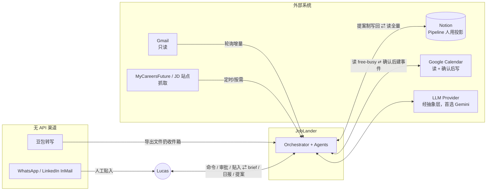
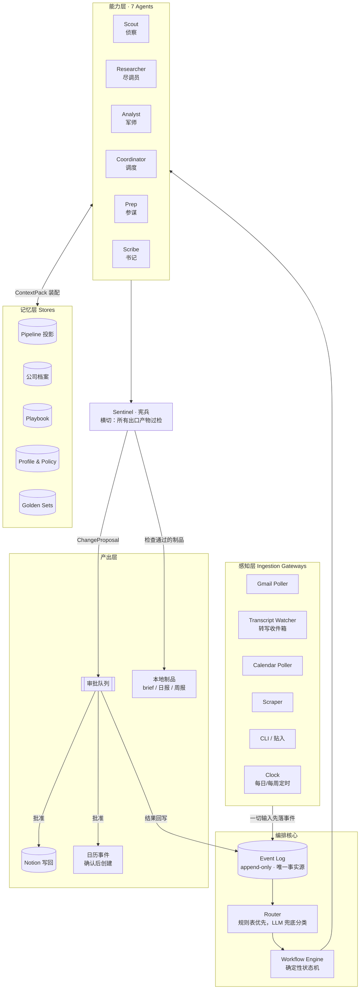
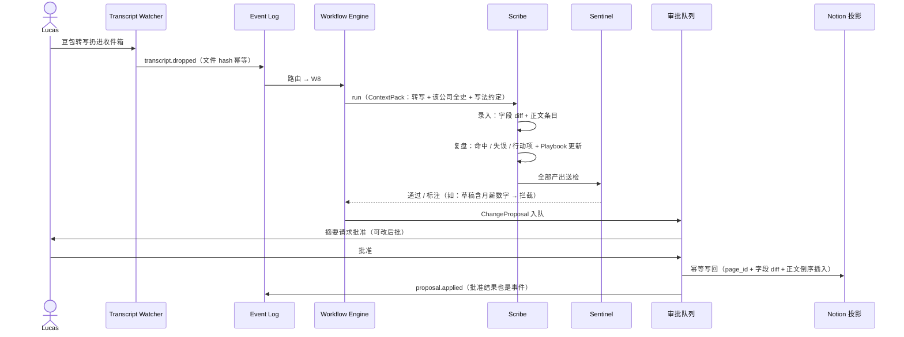
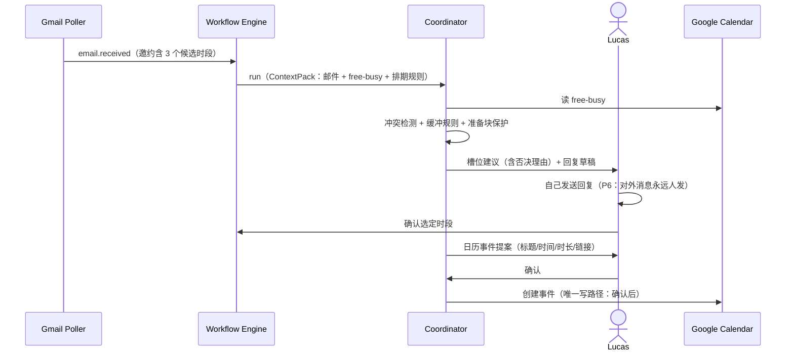
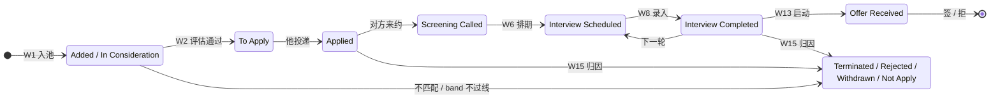
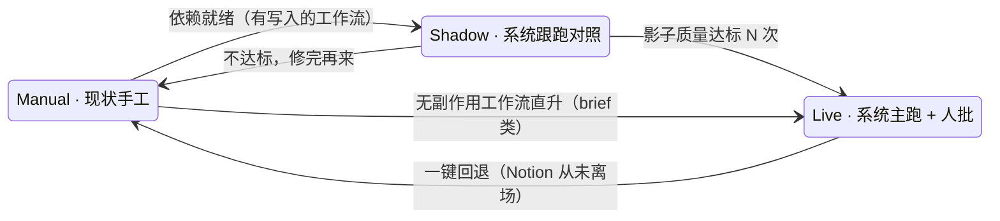

# JobLander 系统设计 v1.2

> 2026-08-06 · v1.2
> v0 → v1 修订驱动：①功能须覆盖求职全生命周期，不受当前手工流程束缚 ②数据架构从第一性重推（结论：事件源 + 投影，见 ADR-1）③图全部改 Mermaid ④组件与流程细节补齐，每个决策给出为什么。
> v1 → v1.1：新增 **§2 用户故事与协作体验**（Day 0 冷启动 / Day N 节律 / 协作契约 / 冷落安全），W0、原则 P7、ADR-12 随之入册，后续章节顺延重编号。
> v1.1 → v1.2：新增 **§12 Migration**（绞杀者式存量迁移：战役不停火、Notion 不搬家、per-workflow shadow→live）+ ADR-13（genesis 快照）；执行 runbook 在 [`MIGRATION.md`](MIGRATION.md)。
> 文中「决定」均为当前定案（ADR 风格：可推翻，但推翻要留新的 ADR）。

---

## 1. 目标与设计原则

### 1.1 系统使命

把一场高强度求职（日均多场面试/通话、9 个信息渠道、6 周硬 deadline）当作一个**运营系统**来运转：信号自动汇聚、评估有章法、准备有弹药、复盘有沉淀、口径有守卫、节律有报表。

双重目标，显式声明：
1. **服役**：真实支撑一场正在进行的求职战役；
2. **作品**：本身是一个可讲、可评测、可开源的 Multi-Agent 系统——每个设计决策都要经得起 system design 面试的追问。

### 1.2 七条设计原则（全文的「为什么」都收敛到这里）

| # | 原则 | 一句话理由 |
|---|---|---|
| P1 | **能力 Agent × 功能 Workflow 分离** | 功能会不断加（"包括但不限于"），Agent 数量不能跟着功能爆炸；新功能 = 新工作流编排，不 = 新 Agent |
| P2 | **确定性骨架，LLM 在边缘** | 控制流是代码（可测、可回放、便宜）；LLM 只做感知（抽取/分类）与综合（写作/判断），不做流程决策 |
| P3 | **单一写路径：一切事实先成为事件** | Event Log 是唯一事实源；Notion、文件、UI 全是投影。重放事件 = 免费的回归测试与审计 |
| P4 | **权限长在工具上，不长在提示词里** | Agent 的权限边界 = 它拿到的工具集合；「禁止对外发送」的实现方式是发送工具不存在 |
| P5 | **Eval 与系统同时出生** | 每个 Agent 带 golden set 与指标，prompt/模型变更必跑回归——LLM-as-judge + bad-case 回归集方法论用在系统自己身上 |
| P6 | **对外动作 100% 人手执行** | 系统起草一切、发送零件事；对真人的每个字都要人过目 |
| P7 | **注意力是第一约束** | 日常喂养 <15 分钟/天；被冷落 48h 不腐烂（fire-and-forget + 静默降级）；系统永不催办 |

### 1.3 非目标

- 不自动投递、不代发任何消息（P6）
- 不做通用 ATS/CRM——为「单人高强度求职」这一个场景做深
- 不追求全自动：审批闸门是特性不是妥协

### 1.4 对现有手工流程的改良（不只是把现状自动化）

| 现状缺陷 | 系统改良 |
|---|---|
| 复盘教训散落在各公司页面，不跨公司流动（同一问题在两家连续失分才被人发现） | **Playbook 存储**：问题模式 → 最佳回答 → 历次战况，每次复盘自动提案更新，Prep 每次自动引用（§9.5） |
| 无周级结构性复盘，策略调整靠感觉 | **周报工作流**：漏斗指标 + 流失归因 + 优先级再平衡提案 |
| 排期靠脑内推演（出现过三连场、五连场） | **排期规则化**：冲突检测、场间缓冲、技术轮前保护准备块 |
| 口径靠记忆守（月薪取整漂移、关键叙事漏打） | **Sentinel 双层守卫**：词表规则层 + LLM 判断层，横切所有产出 |
| 薪酬情报被动等对方报 | 机会入池即触发**薪酬调研工作流**，先有市场数字再进对话 |
| 优先级隐式、随事件漂移 | **组合层优先级**：每周显式回答「这周的小时数投给谁」 |

---

## 2. 用户故事与协作体验

§4 起描述系统内部怎么转；本节描述**从用户这一侧的屏幕看过去**，这个系统是什么、开局要给什么、日常怎么配合。

### 2.1 用户画像

| | 主用户（P0–P2） | 开源用户（P3） |
|---|---|---|
| 处境 | 被裁/窗口期，跑道以月计，日均 1–3 场对话，信息散落 9 个渠道 | 同类处境的工程师，工具偏好各异 |
| 关键约束 | **注意力是第一稀缺**：面试日没有任何精力做录入整理 | 另加：不一定用 Notion、不一定肯配 OAuth |
| 使用姿势 | 深度共建（红笔设计、终端可用） | clone 后 30 分钟跑通，账号渐进连接 |

### 2.2 Day 0：冷启动（用户提供什么）

两条进入路径，产出相同——**系统对你的三层理解**：

| 层 | 内容 | 消费方 |
|---|---|---|
| 事实层 | 履历、量化战绩素材、硬事实（任期/薪资结构/合同约束） | Prep 的弹药、Scribe 的校准 |
| 红线层 | 不能对外说的词与数字、必须跨场次一致的口径 | Sentinel 词表 |
| 策略层 | 锚点/底线/时间轴/地域约束/优先级偏好 | Analyst 的 policy |

**路径 A · 战役中途接入**（P0，本项目自身就是这个 case）：

1. 指认存量：现有 tracker + 材料目录 + 一个 LLM key
2. 系统读全量历史，**反向生成**三层理解的草稿：从历史复盘挖出 Playbook 初版（哪些问题反复出现、哪些回答有效）、从策略文件抽 policy、从红线文件抽词表
3. 用户只做一件事：**审定这三份草稿**（约 30 分钟，一次性）

> 导入即第一次体验：系统读完你 20 天的战史，告诉你「有一个问题模式已连续两次失分且无修复动作」——这比任何 demo 都有说服力。

**路径 B · 从零开始**（P3，开源用户）：

1. **开局访谈**（W0，20–30 分钟结构化对话）：系统像 FDE 做 discovery 一样访谈你——经历与量化战绩、硬事实与红线、目标与约束。访谈产出即三层理解草稿 + tracker 初始行
2. 连接账号，**全部可选**：最小启动集 = 一个 LLM key + 本地文件。Notion/Gmail/Calendar 每连一个解锁对应工作流；无 Notion 则用本地 markdown 投影——事件源架构下投影本来就可插拔（ADR-1）

### 2.3 Day N：一天的节律

以一个真实强度的日子为例（当日两场：14:00 HM 面、16:30 猎头 call）：

| 时刻 | 发生什么 | 用户动作（成本） |
|---|---|---|
| 08:30 | **晨报**（W10）：今日两场；C 公司三面已 5 天未排，附催促草稿；昨晚 3 条提案已写回；无失败任务 | 读 2 分钟；催促草稿复制 → WhatsApp 发出（30 秒） |
| 12:00 | **T-2h brief**（W7）：全史摘要、面试官背景、口径卡（这场必须打的牌 / 禁说清单）、必问三件 | 通勤路上读（5 分钟） |
| 14:00 | HM 面（录音笔在录） | —— |
| 15:10 | 转写导出 → 扔收件箱 | 30 秒 |
| 15:13 | 两张**提案卡**（W8/W9）：字段 diff + 正文条目 + 复盘 + Playbook 战况更新 | 扫一遍、改一个字段、批准（90 秒） |
| 16:15 | **screening brief**（W5）：该问的 band 话术 + 口径卡 | 读 1 分钟 |
| 16:30 | 猎头 call | —— |
| 17:05 | 猎头 WhatsApp 发来 JD + 两个候选时段 → 截图贴入 | 30 秒 |
| 17:06 | Coordinator（W6）：时段 2 与 D 公司技术轮准备块冲突，建议时段 1 + 回复草稿；确认后创建日历事件 | 复制发送 + 一次点头（40 秒） |
| 21:00 | **日记草稿**（W10）：全天叙事 + 明日计划 | 改两句、批准（2 分钟） |

**当日总喂养成本 ≈ 12 分钟**（面试与通话本身除外）。每周日追加一个**刻意的慢时刻**：周报深读 + 优先级拍板（W11/W12，约 15 分钟）——这是全系统唯一主动索取整块注意力的地方。

> 上表的通知与卡片是 P2 目标形态；P0 期节律完全相同，表面是 CLI 与文件（§2.6）。

### 2.4 协作契约（谁做什么）

只有用户能做的事（系统的设计目标就是把这张表压到最短）：

| # | 动作 | 为什么只能是用户 | 单次成本 |
|---|---|---|---|
| 1 | 贴入无 API 渠道内容（WhatsApp / LinkedIn） | 平台无接口，灰色爬取不做 | ~30 秒 |
| 2 | 转写文件扔收件箱 | 录音在用户设备上 | ~30 秒 |
| 3 | 审批提案（批 / 改 / 否） | P6：写入是用户主权 | 20–90 秒/条 |
| 4 | 发送一切对外消息 | P6：对真人的每个字人过目、人手发 | 复制粘贴 |
| 5 | 确认日历事件 | ADR-10 | 一次点头 |
| 6 | 周报拍板 | 策略是用户的领地 | 15 分钟/周 |
| 7 | 战略决策（offer 取舍、锚点调整） | 同上 | 不设限 |

其余一切——扫描、抽取、查重、调研、换算、拼装、结构化、归因、汇总、守卫——是系统的。

### 2.5 冷落安全（负载退化设计）

已被验证的失败模式：**用户最忙的那几天，恰好是最先停止喂养系统的那几天**（本项目自身的手工流程就在五连场当周断更——断供的不是纪律，是注意力）。设计回应：

1. **一切输入 fire-and-forget**：扔了就走，没有任何流程阻塞等待用户
2. **积压不腐**：brief 从 Event Log 取事实，未批准的提案以「⚠️ 未确认」低置信身份进入 ContextPack——审批积压不会让面前弹药过时（事件源的直接红利）
3. **48h 无审批自动降级**：停发单条通知，收敛为每日一条摘要；**面前 brief 属生存功能，永不降级**
4. **回归补课**：积压提案按公司分组，一屏清完
5. **打扰预算**：主动通知上限 = 晨报 1 条/天 + 面前 brief 按需 + 其余全部合并。系统永不催办——催办式工具在高压期的下场是被卸载

### 2.6 交互表面（按阶段演进）

| 阶段 | 表面 | 审批形态 |
|---|---|---|
| P0 | CLI + 文件收件箱（开发者本人可用） | 终端 diff + y / n / edit |
| P2 | Web（手机优先）：审批队列、pipeline 看板、周报页 + ad-hoc 命令框 | **结构化卡片，一屏一决策**——审批流不是聊天流，聊天只留给临时查询 |
| P3 | 开源部署版 + 开局访谈引导 | 同 P2 |

### 2.7 体验 ↔ 工作流溯源

| 体验时刻 | 工作流 | 阶段 |
|---|---|---|
| 开局导入 / 访谈 | W0 | P0 / P3 |
| 晨报与日记 | W10 | P1 |
| 面前弹药 | W5 / W7 | P0 |
| 扔转写 → 提案卡 | W8 / W9 | P0 |
| 贴截图 → 排期与日历 | W1 / W6 | P1 |
| 周日慢时刻 | W11 / W12 | P1 |
| Offer 沙盘 | W13 | P2 |

---

## 3. 功能需求全景（Workflow 目录）

覆盖求职全生命周期。每条是一个**工作流**（W#）——由触发器启动、编排若干 Agent、产出制品或提案。Agent 只有 7 个（§7），工作流可以继续加（P1 原则）。

| W# | 功能 | 触发 | Agent 链 | 产出 | HITL | 阶段 |
|---|---|---|---|---|---|---|
| W0 | 冷启动（导入 / 开局访谈） | 首次运行 | Scribe + Analyst + Sentinel | 三层理解草稿（Playbook 初版 + policy + 词表）+ tracker | 提案 | P0 导入 / P3 访谈 |
| W1 | 机会 sourcing | Gmail 增量 / 贴入 / 定时抓取 | Scout | 入池提案（查重后） | 提案 | P1 |
| W2 | 机会评估 | 入池 / 情报更新 | Researcher → Analyst | 评估快照 + 优先级建议 | 提案 | P1 |
| W3 | 公司调研 | W2 触发 / prep 触发 / 手动 | Researcher | 公司档案更新提案 | 提案 | P1 |
| W4 | 薪酬调研 | 入池 / 谈判前 | Researcher + Analyst | 市场 band + 折价/税后换算 | 只读 | P1 |
| W5 | HR/猎头 screening 支持 | 日历临近 screening | Prep | screening brief（口径卡 + 该问的数字） | auto | P0 |
| W6 | 面试排期建议 | 邮件含时间邀约 / 手动 | Coordinator | 槽位建议 + 回复草稿（他发）+ 日历事件提案（确认后写） | 提案 | P1 |
| W7 | 面试准备 | 日历 T-24h / T-2h / 手动 | Prep（引用 Researcher/Analyst/Playbook） | 轮次定制 brief | auto | P0 |
| W8 | 面试录入 | 转写文件落收件箱 | Scribe → Sentinel | 结构化字段 + 正文条目提案 | 提案 | P0 |
| W9 | 面试复盘 | W8 完成 | Scribe | 复盘（命中/失误/行动项）+ Playbook 更新提案 | 提案 | P0 |
| W10 | 每日总结 | 定时（晚）/ 手动 | Scribe + Coordinator | 日记草稿 + 明日计划 | 提案 | P1 |
| W11 | 每周总结 | 定时（周日） | Analyst + Scribe | 周报：漏斗指标 + 流失模式 + 策略建议 | 提案 | P1 |
| W12 | 优先级再平衡 | W11 后 / 大事件 | Analyst | 组合层：本周小时数分配提案 | 提案 | P1 |
| W13 | Offer 拆解与谈判 | offer 到达 | Analyst + Prep + Sentinel | 对比矩阵 + 谈判 brief + 口径检查 | 提案 | P2 |
| W14 | 人脉/内推管理 | 入池时匹配人脉图 / 触达节律到期 | Scout + Prep | 内推候选人 + 触达草稿（他发） | 草稿 | P2 |
| W15 | 流失归因 | 状态转 Terminated/Rejected | Scribe + Analyst | 归因条目 + **跨公司模式检测**（同一问题重复失分即告警） | 提案 | P1 |
| W16 | 材料一致性巡检 | 简历/叙事/口径变更 | Sentinel | 全量材料 vs 口径红线的一致性报告 | auto | P2 |

> 原始需求清单（机会 sourcing、机会评估、HR/猎头 screening、面试准备、面试时间安排建议、面试录入、总结、面试复盘、每日总结、每周总结、优先级、公司调研、offer 谈判、薪酬调研）→ 全部落位于 W1–W13；W0、W14–W16 是本设计补充的增项。

---

## 4. 系统上下文



要点：**人在环内是拓扑的一部分**，不是旁路——所有对外动作（消息、日历写、SoT 写）都经过 Lucas 这个节点或审批队列。WhatsApp/LinkedIn/豆包没有 API，永久保留人工贴入/落盘入口，系统把「贴入后的一切」自动化。

---

## 5. 架构总览



分层职责：

| 层 | 职责 | 关键性质 |
|---|---|---|
| 感知层 | 把外部世界变成事件，**不做判断** | 每个 gateway 幂等（同一邮件/文件不会产生两个事件） |
| 编排核心 | 事件 → 意图 → 工作流实例 → Agent 调度 | 纯代码，无 LLM 参与控制流（P2） |
| 能力层 | 7 个无状态 worker，输入 ContextPack、输出制品或提案 | 无状态 ⇒ 可并行、可重试、可单测 |
| Sentinel | 横切检查点，所有离开系统的字节过检 | 独立于产出方（写的人不能自己当裁判） |
| 记忆层 | 分职责存储（§9） | 全部可从 Event Log 重建 |
| 产出层 | 制品直接可用；写操作一律排队待批 | 审批结果本身也是事件（可统计放行率） |

---

## 6. 核心抽象

| 抽象 | 定义 | 备注 |
|---|---|---|
| `Event` | 系统感知或做出的任何事实，append-only | `kind` 分层命名：`email.received` / `transcript.dropped` / `proposal.applied` |
| `Opportunity` | 一个机会的全量状态 | 枚举值 1:1 镜像 Notion tracker schema，round-trip 无映射表 |
| `ChangeProposal` | 系统想做的一次写：diff + 理由 + 提案 Agent | **系统永远不直接写，只提案**；批准/否决也是事件 |
| `ContextPack` | 为一次 Agent 运行装配的上下文包 | 显式 token 预算；装配器可测（该进包的关键事实是否进了包） |
| `WorkflowRun` | 一次工作流实例 | 带 `run_id`、每步事件留痕、单次预算与熔断 |

代码见 `joblander/models.py`。

---

## 7. Agent 规格

Agent 按**能力边界**切分，不按功能切分（P1）。判据：工具集合不同、失败模式不同、eval 方式不同 ⇒ 才配成为独立 Agent。

### 7.1 Scout · 侦察（信号 → 标准化机会）

| | |
|---|---|
| 触发 | `email.received`（分类为机会线索）｜`lead.pasted`｜`scrape.completed` |
| 输入 | 原始文本/HTML + pipeline 快照（查重用）+ 人脉图（W14） |
| 输出 | 入池/更新提案；重复时给合并建议而非新行 |
| 工具 | gmail.read · scraper · tracker.read |
| 查重设计 | 三级：公司名精确 → **集团映射**（真实教训：同集团同时只受理一个申请，Shopee 与 Sea 企业线互斥）→ 语义相似岗位提示 |
| 失败模式 | 抽取幻觉（golden set 回归兜底）；漏检（每日 digest 列出未分类邮件，人扫一眼） |
| Eval | 标注的历史真实邮件集：机会识别 P/R + 字段抽取准确率 |

### 7.2 Researcher · 调研（外部证据 → 档案）

| | |
|---|---|
| 触发 | W2/W3/W4 需要证据缺口补齐时，或手动 |
| 输入 | 调研任务（公司 / 岗位 / 薪酬 band）+ 已有档案（增量调研，不重复劳动） |
| 输出 | 结构化档案条目：融资与稳定性、产品与技术栈、组织与关键人物、市场薪酬区间——**每条带来源与抓取日期**（岗位信息会过期，是已踩过的坑） |
| 工具 | web search · scraper · MCF API（结构化挂牌薪资，专补「薪酬」覆盖）· browser（登录态站点按需） |
| 与 Analyst 的边界 | Researcher 只产**证据**，不下判断——证据收集与判断分离，两者失败模式不同（幻觉引用 vs 权重错误），eval 也不同 |
| 成员 | 单成员：**尽调员 Diligence**（ADR-16 起，原调研员已并入）。喂料与零输入是同一 ReAct 循环的两种起步——喂了料（URL 抓全文 / 贴入材料标「人工喂入」低可信级）种子页打底、跳过计划轮与开局盲扫；零输入则计划检索起步。之后同一循环：读材料摘录 → 判五项覆盖（动因/面试/技术栈/薪酬/稳定性）→ 为缺口出新查询 → 死角止损，轨迹随简介落档。事件源 agent:diligence |
| Eval | 来源可溯性抽查（每条结论能否点回原文）+ 时效标注覆盖率 |

### 7.3 Analyst · 军师（证据 + 策略 → 判断）

| | |
|---|---|
| 触发 | W2/W4/W11/W12/W13/W15 |
| 输入 | 档案 + policy（打平线、折价档、锚点——全部来自私有 config） |
| 输出 | 评估快照（band vs 底线、股权按流动性折价、title→数字换算）、优先级建议、offer 对比矩阵、漏斗指标 |
| 核心设计 | **策略即代码**：换算/折价/打平全部是纯函数，LLM 只负责把计算结果写成人话。⇒ 历史决策可重放（policy 改了，一键重算全 pipeline） |
| 组合层职责 | 不只给单机会打分，还回答「本周小时数投给谁」——时间是唯一真正稀缺的资源 |
| Eval | 纯函数单测 + 「解释链与计算一致性」抽查（LLM 叙述不得与数字矛盾） |

### 7.4 Coordinator · 调度（时间域）

| | |
|---|---|
| 触发 | 邮件含时间邀约｜日历变更｜每日计划（W10） |
| 输入 | Calendar free-busy + pipeline 状态 + 排期规则 |
| 输出 | 槽位建议 + 邀约回复草稿（**他发**）+ 日历事件提案（**确认后系统写**——2026-08-06 起 Calendar 开放确认制写入） |
| 排期规则（成文的教训） | ①同日硬面 ≤ 2 场 ②场间缓冲 ≥ 30 分钟 ③技术轮前保护 ≥ 半天准备块 ④方向相反的面试不贴排（叙事切换有成本） |
| 失败模式 | 时区错乱（全部时间带显式时区）；重复建事件（以邮件 message-id 做幂等键） |
| Eval | 历史排期案例回放：规则违例检出率 |

### 7.5 Prep · 参谋（上下文 → 弹药）

| | |
|---|---|
| 触发 | 日历 T-24h 与 T-2h｜手动 |
| 输出（单文件 brief，按轮次类型定制） | ①该公司全史摘要（倒序）②本轮情报：面试官、形式、已知题型 ③**口径卡**：这场不能说什么、必须打出什么牌（Sentinel 词表 + Playbook 命中条目）④战绩选配：按 JD 匹配从素材库选 3 条 ⑤本场必问三件（信息缺口驱动：band 未知就问 band） |
| 轮次类型 | screening / 技术轮 / HM / bar-raiser / 谈判——各有模板与侧重 |
| 关键依赖 | **Playbook**：上一场同类问题的失分，必须出现在下一场同类 brief 的显眼位置（跨面试学习闭环，见 §9.5） |
| Eval | brief 事实性抽查（引用的历史是否真实）+ 口径卡完整率（红线全覆盖） |

### 7.6 Scribe · 书记（原始记录 → 结构化沉淀）

| | |
|---|---|
| 触发 | `transcript.dropped`｜口述碎片贴入｜每日/每周定时 |
| 输出 | ①字段 diff（状态/Highlight/Next Steps/follow-up 日期）②正文条目（`### YYYY-MM-DD 事件` 倒序，守既有写法约定）③复盘：命中/失误/行动项 ④Playbook 更新提案 ⑤日记草稿、周报叙事 |
| 录入 vs 复盘 | 分两步产出：**录入**只陈述事实（说了什么、约了什么），**复盘**才做归因（哪张牌该打没打）——事实与判断分离，便于分开纠错 |
| 失败模式 | 转写质量差（无说话人分离）⇒ 低置信字段标注 `⚠️待确认` 而非硬猜 |
| Eval | 用历史手写复盘当参考答案：字段准确率 + 约定遵从率（Highlight 是否一句话）+ 关键信息召回（band 数字、承诺、日期不许漏） |

### 7.7 Sentinel · 宪兵（横切守卫）

| | |
|---|---|
| 位置 | 不在业务链路里，是**所有出口的过检点**——产出方不能自己当裁判 |
| 规则层（P0，零模型成本） | 词表/正则：月薪具体数字、绩效评级词、前雇主机密词、band 底线数字——出现在对外草稿即拦截；出现在内部制品则标注 |
| 判断层（P1，LLM） | 叙事漂移检测：该打的牌没进 brief、回答口径与历史陈述矛盾（对方会存转写档案，跨场次一致性是硬约束）、同一弱点连续失分未修复 |
| 为什么独立成 Agent | prompt 里写「别说 X」不可证伪、不可回归；独立守卫 = 词表可审计、可单测、每次变更跑 seeded violations 测 P/R。这是市面求职工具都没有的差异件 |
| Eval | seeded violations 的 precision / recall（漏放行是高成本错误，recall 优先） |

---

## 8. 编排设计

### 8.1 事件主循环与路由

```
gateway 落事件 → Router 标注意图 → 查路由表 → 起 WorkflowRun → 逐步调 Agent
```

路由表（节选）：

| 事件 | 意图标注 | 工作流 |
|---|---|---|
| `email.received` | 机会线索 | W1 |
| `email.received` | 邀约含时间 | W6 |
| `email.received` | 拒信 | W15 |
| `email.received` | 无法分类 | 进每日 digest 人扫 |
| `transcript.dropped` | — | W8 → W9（级联） |
| `calendar.upcoming` T-24h | 技术轮 | W7 |
| `clock.daily` 21:00 | — | W10 |
| `clock.weekly` 周日 | — | W11 → W12 |
| `status.changed` → Terminated/Rejected | — | W15 |
| `offer.received` | — | W13 |

意图标注：**规则优先**（发件人域名、模板特征、关键词），置信不足才升级到 flash 级 LLM 分类——这是 P2「LLM 在边缘」的具体落点：分类是感知（可 golden set 测），路由是控制流（纯查表）。

### 8.2 为什么中心编排，而不是 Agent 自由对话

| 备选 | 否决理由 |
|---|---|
| 去中心 A2A（agents 互相唤起、对话协商） | 非确定性随深度复合放大；一次错误写回伤的是真实求职 pipeline，blast radius 不可接受；调试要看 N 方对话记录 |
| 单体大 prompt（一个全能 agent） | 上下文互相污染；权限无法分层（P4 无从谈起）；无法按能力分别 eval |
| **中心编排 + 专职 agents（采用）** | 单点审计与追踪（每个 WorkflowRun 一条链）、单点成本与背压控制、路由可单测 |

### 8.3 可靠性机制

- **幂等**：每事件有唯一键（邮件 message-id / 文件 hash / 日历 event-id），处理器可重入 ⇒ 重试永远安全
- **重试**：指数退避 ×3；仍失败进 **DLQ**，DLQ 摘要出现在次日 W10 日报里（失败不允许静默）
- **级联控制**：工作流级联（W8→W9）显式声明，禁止 Agent 隐式触发 Agent
- **追踪**：`run_id` 贯穿所有步骤事件，任何一份产出都能回答「你从哪些输入算出来的」

### 8.4 模型分层与成本护栏

| 用途 | 档位 | 理由 |
|---|---|---|
| 意图标注、字段抽取 | flash 级 | 高频、结构化、golden set 可测 |
| 复盘综合、brief 组装、周报叙事 | pro 级 | 长上下文综合，质量敏感 |
| Sentinel 判断层 | pro 级、低温 | 误放行成本高于误拦截 |

护栏：每 WorkflowRun 设 token 预算上限，超限熔断并落 `run.budget_exceeded` 事件；月度成本汇总进周报。LLM 调用一律走 `LLMClient` 抽象层（首选 Gemini，可替换，见 ADR-7）。

### 8.5 旗舰时序 ①：面试录入 + 复盘（W8→W9，P0 主链路）



### 8.6 旗舰时序 ②：排期建议（W6，展示确认制日历写入）



---

## 9. 记忆与数据

### 9.1 存储清单

| Store | 内容 | 形态 | 为什么这个形态 |
|---|---|---|---|
| **Event Log** | 一切事实 | append-only JSONL（P3 迁 Firestore） | 唯一事实源；重放 = 重建任何投影 + 免费回归测试 |
| **Pipeline 投影** | 机会状态 + 每公司时间线 | **Notion**（tracker + 页面正文） | 人用主界面：手机可用、已有 30+ 家历史、他随手可改 |
| **公司档案** | 调研证据（带来源与日期） | Notion 页面正文（人读）+ 本地结构化缓存（机读） | 同一份内容两种消费方式 |
| **Playbook** | 问题模式 → 最佳回答 → 历次战况 | 本地结构化文件（git 版本化） | 跨公司复用资产；变更历史本身有价值 |
| **Profile & Policy** | 简历事实、红线词表、薪酬阈值 | 私有 config + workspace | 绝不入公开库（§13） |
| **Golden Sets** | 各 Agent 评测集 | 本地文件 | 可复现、可 diff；含真实数据 ⇒ 私有，开源需脱敏 |

### 9.2 为什么事件源（ADR-1 的展开）

从第一性重推（不预设现有 workspace/Notion 分工）比较过四个方案：

| 方案 | 优点 | 致命伤 |
|---|---|---|
| A. 全 Notion（状态+文档+制品都在 Notion） | 单一地点、移动端好 | API 延迟与限流扛不住高频机器写；golden set/事件日志是机器制品，塞进 Notion 既慢又不可复现；无法 git 版本化 |
| B. 全本地（Notion 退役） | 机器友好、git 一切 | 移动端丢失——WhatsApp/临时审批都发生在手机上；人工编辑体验差 |
| C. 自建 DB 为 SoT，Notion 只读镜像 | 查询自由 | 「只读镜像」不成立：他一定会直接改 Notion（这是正确的使用方式），镜像立即分叉 |
| **D. 事件源 + 投影（采用）** | 见下 | 和解逻辑要自己写（代价已接受，见 9.3） |

D 的关键洞察：**争「Notion 还是本地是 SoT」是个假问题**。SoT 是 Event Log；Notion 是最重要的**人用投影 + 人工编辑入口**（他的直接修改被 diff 探测后变成 `notion.edited` 事件回流）。由此：机器高频写不打 Notion API（先写日志，批准后才投影）、任何投影可重建、审批率/漏斗指标直接从日志算。

### 9.3 Notion 双向和解（本设计最难的一块，如实标注）

- 方向 ①系统→Notion：只经批准的 proposal，按 `page_id` + 字段 diff 幂等写
- 方向 ②Notion→系统：定时拉取 + 与上次快照 diff → 产 `notion.edited` 事件
- 冲突（同字段两边都改）：**字段级 last-writer-wins + 冲突事件上报**，正文条目天然 append-only（`### 日期` 倒序插入）几乎不冲突
- 明确接受的残余风险：diff 轮询有窗口期；窗口内的写冲突靠冲突事件人工裁决。不引入实时 webhook（复杂度不配 P0–P1 的规模）

### 9.4 机会状态机

状态值 1:1 镜像现有 tracker（迁移零成本），转移边由系统事件或人工触发：



每次进入 `END` 强制过 W15（流失归因）——**失败数据是 Playbook 的主要养料**，不允许无归因关闭。

### 9.5 Playbook（跨面试学习闭环）

条目结构：

```yaml
- pattern: "稳定性 / 短任期质疑"          # 问题模式
  best_answer: <当前最佳回答模块>          # 随复盘迭代
  evidence: [<支撑的事实与数字>]
  engagements:                             # 历次战况
    - {date: ..., company_ref: ..., outcome: miss, note: "未主动前置，对方复述为风险"}
    - {date: ..., company_ref: ..., outcome: hit}
  status: needs_work                       # hit 率驱动
```

闭环：W9 复盘写入战况 → `status` 恶化触发告警（**同一模式连续两次 miss = 高优先级修复项**，进当周 W11）→ W7 的 brief 把 `needs_work` 条目置顶。这是 §1.4 第一条改良的实现。

### 9.6 ContextPack 装配

每次 Agent 运行的上下文显式装配：任务定义 + 相关档案 + 命中的 Playbook 条目 + 最近 N 条相关事件，带 token 预算（默认上限 32k）。装配器本身进 eval（「该进包的关键事实是否进了包」）——上下文工程当一等公民，而不是把整个世界塞进 prompt。

---

## 10. 决策记录（ADR）

| # | 决策 | 备选与否决理由 | 代价（已接受） |
|---|---|---|---|
| ADR-1 | Event Log 为 SoT，Notion 为人用投影 + 编辑入口 | 全 Notion / 全本地 / 自建 DB——见 §9.2 | 和解逻辑自己写；轮询窗口期 |
| ADR-2 | 权限在工具层（capability-based） | 放 orchestrator 集中安检——安检不应依赖调用方自觉；agent 拿不到的工具就是不存在 | 工具集合按 agent 配置，多一层装配代码 |
| ADR-3 | 30 家规模不上向量库，全文进 ContextPack | 「标配 RAG」——为想象的规模付复杂度税；到数百家（开源用户）再加检索层 | 单公司全史超预算时需手动摘要策略 |
| ADR-4 | Sentinel 独立成横切 Agent | 各 agent prompt 自我约束——不可证伪、不可回归、产出方自裁 | 每条链路多一跳延迟 |
| ADR-5 | Eval 与系统同生（golden set 全部来自真实历史数据） | 「先跑起来再补测试」——prompt 系统没有回归集 = 每次改动都是赌博 | 标注成本；真实数据 ⇒ 评测集私有，开源需脱敏 |
| ADR-6 | 手写编排，不上框架（LangGraph/ADK） | 框架省重试/持久化轮子，但把最有练习价值的部分黑盒掉；P0 规模轮子成本可控 | 自己维护状态机与重试；P2 复杂度失控则重评（届时迁移理由本身是好素材） |
| ADR-7 | LLM 走抽象层，首选 Gemini | 直接绑 SDK——开源用户各有偏好；GCP 全栈叙事需要 Gemini 做默认 | 抽象层维护；各家 function-calling 方言适配 |
| ADR-8 | 路由确定性优先，LLM 只做置信不足时的分类兜底 | 全 LLM 路由「更智能」——控制流不可测则整个系统不可测 | 路由表要人工维护 |
| ADR-9 | Agent 按能力切 7 个，功能靠 Workflow 组合 | 每功能一个 agent（17 个）——上下文碎片化、eval 面爆炸、编排图不可读 | 单 agent 职责较宽，prompt 需按工作流参数化 |
| ADR-10 | Calendar 写开放但确认制（2026-08-06 授权）；Gmail 维持只读；对外消息永远人发 | 全自动排期——日程是他对外承诺的一部分，错误成本不对称 | 每个日历事件多一次确认交互 |
| ADR-11 | 图用 Mermaid（diagram-as-code） | Draw.io——二进制 XML 难 diff；Mermaid 随 markdown 版本化，GitHub/Notion/编辑器原生渲染 | 表达力上限低于 Draw.io（可接受） |
| ADR-12 | 输入 fire-and-forget + 48h 静默降级 + 打扰预算（§2.5） | 催办/强提醒——催办式工具在用户高压期被直接弃用（本项目手工流程即因此断更）；全自动绕审批——违反 P6 | 积压提案的「未确认」低置信状态要在 ContextPack 里显式建模 |
| ADR-13 | 存量迁移用 genesis 快照入账，不做历史事件重放（§12） | 全量历史重放——20 天散文式记录无法忠实还原成细粒度事件，伪造时间戳会污染统计与 eval | pre-genesis 历史只能按文档查询；漏斗指标从 genesis 起算 |
| ADR-14 | 公司档案（18-companies/）为公司级本地 SoT，Notion 降为镜像 + 移动端入口，`notion.write_enabled` 一键退役 | 继续以 Notion 正文为公司级事实源——结构化（参与方/附件/AI-人工署名/匹配评估）塞不进自由正文；退役靠「存量条目补复盘即本地化」渐进迁移，不做一次性搬家 | 并行镜像期双写；Notion 断写前移动端只读依赖 Notion（U9 上云后解除） |
| ADR-15 | 公司**正文停双向同步**（2026-08-10，取代 ADR-14 的镜像期）：时间线只读写本地档案，Notion 正文不再合并读、不再 append 写，页面只留一个 Notion 链接；字段（状态/Highlight 等）照写 | 继续合并读+双写——(日期,标题) 配对去重在编辑改名/改期时断裂，「保存变新建」「顺序跳动」两类 bug 均源于此；一次性 backfill 后合并读已是纯开销 | Notion 页面正文停更新，手机看新事件走 web UI；他在 Notion 手写的新纪要不再自动进时间线（可手动 backfill，尊重墓碑与正文顺序） |
| ADR-16 | 调研员并入尽调员（2026-08-11）：Researcher 域单成员，喂料（URL/贴入材料）成为尽调 ReAct 循环的种子起步——种子打底跳过盲扫，缺口照常补搜，贴入材料标「人工喂入」低可信级，抓取失败如实入档 | 维持两名成员——「喂料」与「自查」只是种子不同，覆盖判定/补搜/来源分级全程共用；分开的实际代价已显现：调研员接线齐全但实战零使用（0 条 dossier.updated 事件），白养一套 prompt、出口与 UI 分支 | 纯喂料不检索的模式不复存在（种子薄时循环必然补搜，属预期行为）；dossier.updated 事件类型退役 |

---

## 11. 阶段计划

| 阶段 | 交付 | 验收 |
|---|---|---|
| **P0** | Event Log + W0 导入（路径 A：存量 tracker/workspace 反向生成三层理解草稿）+ W7（Prep）+ W8/W9（Scribe）走 CLI；Sentinel 规则层；写回半自动（提案生成 → 人批 → 系统写） | 用积压的真实转写跑通「转写 → 提案 → 批准 → Notion」全链；brief 在下一场真实面试前生成并被实际使用；**单日喂养成本实测 ≤15 分钟** |
| P1 | W1（Scout+Gmail）、W2–W4（Researcher/Analyst）、W6（Coordinator+日历确认写）、W10/W11/W15、Sentinel 判断层、eval harness v1 | golden set 首跑出分并建立基线；一周内新机会零手工录入 |
| P2 | Web 层（FastAPI + 轻前端）：审批队列、pipeline 视图、周报页；W13/W14/W16 | 手机上完成一次完整审批；一次真实 offer 跑过对比矩阵 |
| P3 | Cloud Run + Firestore + Gemini 正式化；公私分离审计；英文文档；W0 开局访谈（路径 B） | 陌生人 clone 后 30 分钟内跑起来（自己的 Notion/Gmail 或纯本地投影） |

**每阶段收尾仪式**：把该阶段设计与取舍讲成一个 8 分钟 system design 口头答案并演练一次——练习产出是交付物，不是副作用。

P0 前置（需要账号操作，到步骤时给具体命令）：
1. Notion integration token（只授权 Tracker 所在页面）
2. 转写收件箱目录约定：`<workspace>/06-transcripts/YYYY-MM-DD-公司.md`
3. Gmail OAuth 推迟到 P1

---

## 12. Migration：存量战役的迁移策略

系统不是绿地起步：一场进行了 20 天、37 行（以实扫为准）、本周仍有排期的真实战役正跑在手工流程上。本节定原则；可执行 runbook（资产盘点、体检规则、切换判据、回退方案）在 [`MIGRATION.md`](MIGRATION.md)。

### 12.1 五条迁移原则

| # | 原则 | 含义 |
|---|---|---|
| M-P1 | **绞杀者模式，不大爆炸** | 按工作流逐条接管；任何时刻两套流程并存可用 |
| M-P2 | **战役不停火** | 全程无冻结窗口、不改变用户任何现有动作；迁移唯一要求的新习惯 = 转写扔收件箱（30 秒/次） |
| M-P3 | **Notion 不搬家** | ADR-1 下 tracker 本来就是人用投影——迁移的对象是**流程与知识**，不是数据搬运。⇒ **回退 = 关停进程**，其余什么都不用做 |
| M-P4 | **历史不伪造** | 存量状态以 genesis 快照入账（ADR-13）；散文式历史作为文档进系统，不拆成伪造时间戳的细粒度事件 |
| M-P5 | **人力预算封顶** | 用户全程 ≤2 小时，集中在三个审定点；其余全是机器活 |

### 12.2 每个工作流的三态切换



判据示例（完整表在 MIGRATION.md §7）：W7/W5（brief 类，无副作用）**直接 live**——错了大不了不用；W8/W9 影子跑真实转写，**连续 3 份提案 ≤1 处字段修正**才切 live；W10 连续 5 天日记草稿修改量 <20%。

### 12.3 阶段一览

| 阶段 | 内容 | 机器成本 | 用户成本 |
|---|---|---|---|
| M0 | 快照 + 数据体检（只读） | <1h | 0 |
| M1 | 三层理解生成（= W0 路径 A 执行） | 2–3h | 审定点 ① 30 min |
| M2 | Tracker 规范化（提案制，分两批） | <1h | 审定点 ② 15 min |
| M3 | Genesis 入账 + 对账 | <1h | 0 |
| M4 | Playbook 初采 + golden set 种子 | 2–3h | 审定点 ③ 30 min |
| M5 | 影子运行 → 逐流切 live | 持续 | <10 min/周 |
| M6 | 旧流程退役记账 | — | 0 |

---

## 13. 公私边界（开源前提）

| | 内容 | 位置 |
|---|---|---|
| 公开 | 引擎代码、本文档、config.example（占位数字）、脱敏后的 eval 样例 | 本仓库 |
| 私有 | config.yaml（凭证、薪酬阈值、红线词表）、workspace 全部、Event Log、golden sets 原始数据 | workspace，gitignore |

开源前审计：全库 grep 风险清单（薪酬数字、绩效、条款、真实人名/公司内部信息）+ pre-commit hook；golden set 随代码开源前必须完成脱敏（实体替换 + 数字扰动）；`MIGRATION.md` 含真实战役细节，开源时脱敏或整篇排除。

## 14. 风险与开放问题

1. **Notion 和解窗口期冲突**（§9.3）——已定字段级 LWW + 冲突事件，观察实际发生率再决定是否上 webhook
2. **转写质量**：豆包无说话人分离时 Scribe 归因易错 ⇒ 低置信标注策略，必要时换转写源
3. **数据外流面**：转写含双方真实姓名与公司信息，会进 LLM API ⇒ P1 前审阅 provider 数据留存条款，评估预处理脱敏
4. **自治级演进**：某类提案连续 N 次零修改批准后，是否开放该类自动落地？——倾向保守：只对无外部副作用的类别（如正文条目追加）开放，任何对外可见写永远确认制
5. **成本上限**：先跑两周统计真实 token 账单，再定预算常数
6. WhatsApp/LinkedIn 永久人工贴入——接受，不做灰色爬取

## 15. UI v2（2026-08-07 用户反馈修订）

第一版 UI 按「模块」组织（工具页 = 引擎函数的表单化），被用户否决：**「UI 要面向用户，而不是面向系统」**。修订后的三条铁律：

1. **入口按用户动作放，不按系统模块放。** 工具页解散：brief/转写录入/评估长在公司档案页，线索贴入与口径检查是全局随手动作（侧栏 modal），邮件扫描长在审批页。判断标准：用户不需要知道「这是哪个 Agent 的功能」。
2. **公司档案页是主战场**（求职 = 逐家公司打仗）。结构化三卡（岗位/投递/匹配）+ 战役时间线（参与方、附件、全文折叠）+ 弹药 + 调研档案。**AI 产出与人写内容必须视觉可分辨**（蓝 AI / 琥珀人工署名徽章）；面试事件挂「我的复盘」人工区，与 AI 复盘分开存放。
3. **看板即漏斗。** 机会页默认 Kanban（7 列 = 漏斗阶段），拖卡片 = 改状态 = 直写；High 优先级左缘红条 + 逾期 follow-up 红徽章。表格视图保留给精确批量编辑。

### Notion 退役三阶段（回应「shadow 并行 → 排除 Notion 依赖」）

| 阶段 | 状态 | 判据 |
|---|---|---|
| A 并行镜像（现在） | 双写：批准/直改同时落本地档案与 Notion；Notion 手改经 F2 diff 回流 | — |
| B 本地为主 | 观察期：他不再打开 Notion 编辑（F2 diff 连续两周≈0） | 移动端需求已由 U9 上云覆盖 |
| C 退役 | `notion.write_enabled: false`，Notion 冻结为历史存档；读 pull 再关 | 一键，可逆 |

存量迁移不搬家：时间线合并 Notion 正文 `### 日期` 存量条目（(日期,标题) 去重、本地优先），给存量条目补人工复盘即自动「本地化」——数据随使用自然迁移。

### v2.1（同日追加）：审批回属地，弹药入备战

用户追问「审批具体在批什么？集中放一页不奇怪吗？」——对。审批 = **AI 想写入你系统的东西**（提案制的写闸门），一共只有三种，各有属地；集中队列是面向系统的残留，解散：

| 提案 | 批准即 | 属地（在哪批） |
|---|---|---|
| Scout 入池 | tracker 建行 + 建公司档案 | 机会页「待入池」条（批量清噪也在这） |
| Scribe 面后录入 | 字段 + 时间线条目 + Playbook 战况 | 公司页时间线顶部（带上下文批） |
| 日记草稿 | 追加找工日记 | 今天页 |

人写的东西（原位编辑、我的复盘、拖看板）不排队——动作本身即批准。侧栏角标挂在「今天」上，今天页「现在就做」按属地分发链接；回归补课（冷落 48h 后清积压）= 机会页批量条 + 今天页分组链接。

弹药库同理解散：brief 是「为该公司下一步动作做的准备」→ 公司页「备战」区（下一步动作 + 最新 brief 并排，历史折叠）。全局导航收敛为：今天 / 机会 / 打法 / 系统。

### v2.2（同日追加）：「新机会」独立成页——sourcing 与 tracking 分离

用户判断：找新机会和打已有战线是两种心智模式，混在机会页互相干扰。拆分后：**新机会页** = 主动侦察（W1 扩展），**机会页** = 已有申请跟踪（看板/表格），清爽。

新机会页三件套：①**待入池**（按 fit 评分排序，≥3 直陈、低分折叠，批量否决）②**搜索偏好**（意向/关键词/地点/排除词——存私有 workspace，喂给评分器与搜索源，UI 可编辑=U6 首例）③**渠道卡**（诚实分级）：

| 渠道 | 自动化 | 实现 |
|---|---|---|
| Gmail（含 LinkedIn Job Alert 邮件） | 全自动 | 30min 循环 + 分类闸 |
| MyCareersFuture | 全自动 | 公开 API，夜扫 02:30 按关键词抓新岗 → fit 评分 → 待入池 |
| LinkedIn Search / Inbox | 半自动 | 无 API 不爬（红线）；按偏好拼 24h 搜索深链一键打开 + 人工贴入 |
| WhatsApp / 任意 JD | 贴入 | 全局「＋ 贴入」→ 抽取+查重+评分 |

fit 评估（1-5）只消费偏好文本与岗位公开信息，不接触薪酬红线；中介代招不扣分但进 flags。夜扫幂等（uuid seen 去重），排除词命中在源头丢弃记账。
