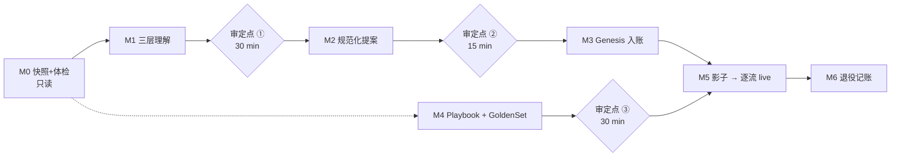

# JobLander 迁移 Runbook（存量战役 → 新系统）

> 2026-08-06 · runbook v1 · 原则与 ADR-13 见 [`DESIGN.md`](DESIGN.md) §12
> 性质：一次性操作文档，含真实战役细节 → 开源时脱敏或整篇排除（DESIGN §13）。

## 0. 约束（复述自 DESIGN §12.1，执行时逐条对照）

- **战役不停火**：pipeline 上有本周排定的真实面试。全程无冻结窗口，不改变用户任何现有动作，直到某工作流正式切 live
- **Notion 不搬家**：tracker 与日记留在原地做人用投影。迁移的对象是流程与知识，不是数据搬运
- **回退零成本**：任何时刻关停系统，手工流程原样可用；系统侧 append-only，无破坏性写
- **人力预算**：用户全程 ≤2 小时（三个审定点），单次 ≤30 分钟
- **唯一新习惯**：面后转写扔收件箱 `<workspace>/06-transcripts/YYYY-MM-DD-公司.md`（30 秒/次）

## 1. 资产盘点与归宿

| # | 存量资产 | 现状 | 归宿 | 处理 |
|---|---|---|---|---|
| A1 | Notion Tracker（37 行，以实扫为准） | 活跃，双方在写 | **接管不搬家**：继续做 Pipeline 投影 + 编辑入口 | M2 体检规范化 + M3 genesis 注册 |
| A2 | Notion 找工日记 | 手写，节律不稳 | 页面保留；产出方式切到 W10（草稿 → 他批） | M5 切换 |
| A3 | STRATEGY.md（锚点/打平线/时间轴/折价档） | 本地 | **策略层** → `config.policy` | M1 抽取 + 审定 |
| A4 | CLAUDE.md 事实红线表 | 本地 | **红线层** → Sentinel 词表与规则 | M1 抽取 + 审定 |
| A5 | CLAUDE.md 权限分级 / 起草原则 / 写法约定 | 本地 | HITL 工具权限配置 + Scribe/Prep 输出模板 | M1 转译 |
| A6 | achievement-bank.md / narrative.md | 本地 | **事实层** profile 索引 + Playbook 原料 | M1 + M4（原文件保留为准源） |
| A7 | 01-profile 硬事实（离职包/合同约束） | 本地 | 事实层（仅口径需要的字段进索引） | M1，原件不动 |
| A8 | referral-map.md（533 联系人） | 本地 | 人脉图（W14，P2 才用） | 暂缓，M6 记账 |
| A9 | 05-prep 通用面试准备 | 本地 | Prep 引用源 | 直接挂载，不改造 |
| A10 | 04-pipeline/pipeline.md | 已废弃 | 保持废弃 | 无动作 |
| A11 | Gmail / Calendar | 活数据源 | **连接而非迁移** | P1 OAuth 时接入 |
| A12 | 豆包历史转写（若可从 App 导出） | 手机 | Scribe golden set 素材 + 可选的 W8 影子首批材料 | M4，尽力而为，不强求 |
| A13 | 手写历史复盘（tracker 正文 + 日记 20 天） | Notion | Scribe golden set 参考答案 + Playbook 挖掘源 | M4 |
| A14 | ChatGPT 会话 / Hello-Agents | 外部 | 不迁（声明过的非系统组成） | 无动作 |

## 2. M0 · 锚定快照与数据体检（只读，零风险，随时可跑）

1. 拉取 tracker 全量行 + 全部页面正文 + 日记全文 → 存 `migration/snapshot-<date>/`（私有 workspace，不入引擎仓库）
2. 体检规则（只出报告，不动任何行）：

| 规则 | 检查 | 已知规模（以实扫为准） |
|---|---|---|
| R1 必填缺失 | Priority / Source / 关键日期为空 | ≥5 行缺 Priority |
| R2 终态卫生 | 终态行（Terminated/Rejected/Withdrawn/Not Apply）仍挂 follow-up | ≥6 行 |
| R3 活跃时效 | follow-up 过期、Next Steps 与近事件矛盾（如已另约面试仍写旧动作） | 若干，实扫定 |
| R4 重复噪声 | 已标注合并的重复行、无真实接触的推送行 | ≥2 行 |
| R5 约定偏离 | Highlight 超一句话、正文缺 `### 日期` 结构 | **仅登记不修复——历史不重写** |

3. 产出：《体检报告》分类计数 + 逐行清单
   成本：机器 <1h ｜ 用户 0

## 3. M1 · 三层理解生成（= W0 路径 A 执行）

| 源 | 目标 | 转换要点 |
|---|---|---|
| STRATEGY.md 数字与换算表 | `config.policy` | 锚点/底线/打平线/折价档/汇率假设；**数字只进私有 config，永不入库** |
| CLAUDE.md 红线表 | `config.sentinel` | 每条红线 → 规则类型：禁词表（评级词）/ 数字模式（月薪具体数）/ 成对约束（报总包必须带结构拆解） |
| narrative.md + achievement-bank.md | profile 结构化索引 | 抽取索引（战绩条目、叙事模块），原文件保留为准源 |
| CLAUDE.md 权限分级 ✅/⚠️/🚫 | 工具权限配置 | 直译为 auto / propose / forbidden 三级 |
| Tracker 写法约定 | Scribe 输出模板 | Highlight 一句话、`### YYYY-MM-DD` 倒序、icon 约定 |

产出三份草稿 → **审定点 ①（30 min）**：重点核对红线词表的查全（漏一条词表 = Sentinel 形同虚设）
成本：机器 2–3h ｜ 用户 30 min

## 4. M2 · Tracker 规范化（提案制，分两批）

- **批次 1 · 活跃行优先**：补 R1 缺失、修 R3 时效（stale follow-up 重新定或清空）、对齐 Next Steps 与真实状态
- **批次 2 · 终态行卫生**：清 follow-up（R2）、重复行提议 archive（R4）
- 全部以 ChangeProposal 批量产出，按批一次审 → **审定点 ②（15 min）**
- 验收：R1–R4 清零；R5 只登记
- 成本：机器 <1h ｜ 用户 15 min

## 5. M3 · Genesis 入账

- 每行一条 `genesis.imported`：payload = 全量属性 + `notion_page_id` + 快照哈希（provenance 可回溯）
- 日记与页面正文 → `document.imported`：引用原文整体，**不拆散文为伪事件**（ADR-13）
- 语义边界：pre-genesis 历史按文档查询；post-genesis 一切变化走正常事件流；漏斗统计起点 = genesis
- 验收：行数对账 100%；抽样 5 行 round-trip（事件 → 重建投影 → 与 Notion 当前值一致）
- 成本：机器 <1h ｜ 用户 0

## 6. M4 · Playbook 初采 + Golden Set 种子

- 从 A13 挖问题模式 → **Playbook v0**（预期 5–10 条：稳定性/短任期质疑、薪酬口径一致性、关键叙事漏打、band 先问数字后谈 title……以实挖为准）
- Golden sets 种子：

| Agent | 来源 | 规模 |
|---|---|---|
| Scout | 历史真实邮件，人工标注「是/否机会 + 关键字段」 | ~20 封 |
| Scribe | 手写复盘当参考答案 | ~6 份 |
| Sentinel | 从红线表构造 seeded violations | 一组 |

- → **审定点 ③（30 min）**：重点审 Playbook 的 `best_answer` 是否代表本人口径——**这是系统第一次替他说话的地方，错这里比错架构严重**
- 成本：机器 2–3h ｜ 用户 30 min

## 7. M5 · 影子运行与逐流切换

| 工作流 | 起始模式 | 切 live 判据 | 说明 |
|---|---|---|---|
| W7 / W5（brief 类） | **直接 live** | 第一份 brief 在真实面试中被使用且无事实错误 | 无副作用：本地文件，错了不用即弃 |
| W8 / W9（录入+复盘） | shadow | **连续 3 份真实转写：字段提案 ≤1 处修正、正文条目零事实错** | 影子期系统产提案但不写 Notion，与他的手工记录对照；若 A12 历史转写可导出，先用历史料跑，否则从下一场真实面试起算 |
| W10（日记） | shadow | 连续 5 天草稿修改量 <20% | 修改量 = 他改动的行占比 |
| W1/W6/…（P1 各流） | 按同模板进 | 各自判据在 P1 计划时定 | 模板：无副作用直升；有写入先影子 |

- 影子对照报告由系统生成 diff，用户只看结论行
- 双轨期用户额外成本目标：<10 min/周
- **触发即迁移完成的标志**：P0 三条工作流全部 live 且 DESIGN §11 P0 验收达标

## 8. M6 · 旧流程退役清单

| 旧流程 | 退役方式 |
|---|---|
| 手工往 tracker 录字段/正文 | W8/W9 live 后自然停止——他仍可随手改，**那是 ADR-1 的编辑入口，不是违规** |
| 手写日记从零起笔 | W10 live 后改为「改草稿」 |
| 每次会话人肉重建上下文（CLAUDE.md 开场序列） | 改为读系统投影/晨报；届时更新 CLAUDE.md |
| pipeline.md | 保持废弃 |

**永不退役**：他直接改 Notion 的权利；口径红线的人工终审；一切对外消息人手发送。

## 9. 回退方案

| 层级 | 动作 | 影响 |
|---|---|---|
| 单工作流 | 该流切回 manual | 其余工作流不受影响 |
| 全系统 | 停进程 | Notion 手工流程原样可用；零数据损失（append-only；未批提案 = 未发生） |
| genesis 作废重来 | 重打快照、重放入账 | 事件源天然支持，成本 <1h |

## 10. 完成定义（DoD）

- [ ] 审定点 ①②③ 完成，三层理解生效
- [ ] R1–R4 清零；genesis 对账 100%
- [ ] W5/W7/W8/W9 live，DESIGN §11 P0 验收达标（含单日喂养成本 ≤15 min 实测）
- [ ] Playbook v0 ≥5 条，且至少一份真实 brief 引用过其中条目
- [ ] 双轨期用户额外成本实测 ≤ 预算
- [ ] CLAUDE.md 更新（开场序列、工具表）
- [ ] 本文档标记「已执行」，归档快照目录

## 11. 执行流

关键路径：M0 → M1 → M2 → M3 → M5。M4 与 M2/M3 并行，只卡 M5 里 W8/W9 的影子质量评估（需要 golden set 做基线）。

---

## 12. 执行日志

| 日期 | 动作 | 产出 |
|---|---|---|
| 2026-08-06 晚 | **M0 执行**（属性层 + 日记；37 页正文快照顺延——9 家详细复盘实际在 Feedback 属性中，已随属性快照落盘，正文紧迫性下降） | `<workspace>/migration/snapshot-2026-08-06/`：tracker-rows.json（37 行）、diary.md、audit-report.md（R1 9 处 / R2 6 行 / R3 10 行 / R4 2 行 / R5 登记） |
| 2026-08-06 晚 | **M1 草稿生成** | `<workspace>/migration/m1-drafts/`：policy / sentinel / profile-index / permissions 四份 → 待审定点 ① |
| 2026-08-06 深夜 | **审定点 ①②通过**（policy/sentinel 经红笔改 v2：目标去硬 deadline、薪资规则改「谁先说+说到多准」轴） | m1-drafts v2 生效 |
| 2026-08-06 深夜 | **M2 执行**：批 1（14 行，含 OpenAI→Screening Called+High、Singtel→Not Apply）+ 批 2（6 行清 follow-up；archive 依预案豁免）；占位符由 `06-communites/` 纪要补全 | Notion 写回完成，round-trip 抽样 7 行全部一致 |
| 2026-08-06 深夜 | **M3 执行**：genesis 入账 37 行 + 2 份文档 + 3 条迁移事件 | `<workspace>/08-events/event-log.jsonl`（Event Log 正式启用；A12 修正：豆包纪要早已在 `06-communites/` 本地存在，42 份，M4 主料就绪） |
| 2026-08-07 凌晨 | **M4 执行**：Playbook v0（8 模式 × 26 条战况，含猎头转述版资产）+ Sentinel seeded violations 16 条 + Scribe 参考答案清单 6 例（Scout 集推迟至 P1） | `<workspace>/03-materials/playbook.yaml`、`migration/m4-golden-seeds/` → **待审定点③**（重点：best_answer 与转述版是否代表本人口径） |
